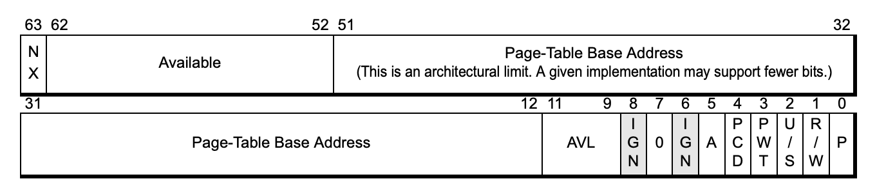

# Memory Manager

This header includes the decleration of functions and structures related to the translation of guest addresses to host addresses. 

To get more details and have a better understanding of this part, please reffer to:
* Windows Internals, seventh editing, pages 373-375 (32-bit version only).
* Intel Developer Manual, volume 3C part 3, chapter 28 - [Intel Developer Manual](https://www.intel.com/content/dam/www/public/us/en/documents/manuals/64-ia-32-architectures-software-developer-vol-3c-part-3-manual.pdf)
* AMD64 Developer Manual, volume 2, chapter 5 - [AMD64 Developer Manual](http://developer.amd.com/wordpress/media/2012/10/24593_APM_v2.pdf)

For your convenience, here are few important quotes from the second source:

> The extended page-table mechanism (EPT) is a feature that can be used to support the virtualization of physical
memory. When EPT is in use, certain addresses that would normally be treated as physical addresses (and used to
access memory) are instead treated as guest-physical addresses. Guest-physical addresses are translated by
traversing a set of EPT paging structures to produce physical addresses that are used to access memory.

> The EPT translation mechanism uses only bits 47:0 of each guest-physical address. It uses a page-walk length of
4, meaning that at most 4 EPT paging-structure entries are accessed to translate a guest-physical address.

## Page Table Entry Layout

The union `QWORD_PAGE_TABLE_ENTRY` is based on the above layout.
